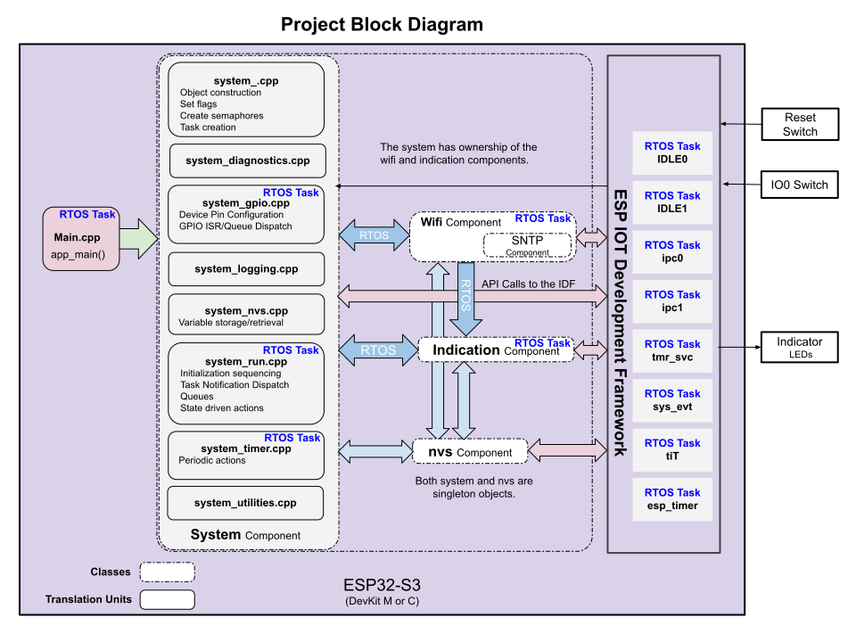

# Project Alpha 5.2 V1
---
This is a starter project for a dual core Esp32 microcontroller running FreeRTOS.  The hardware is equivalent to a DevKit-M or C running an Esp32S3 N16R8, but this project should be portable to other dual and single core Esp32 processors without any changes.

The intent of this example project is to prepare a suitable development code base for high-performance, commercial, large scale advanced project development. In pursuit of that goal, this project will evolve to include many other features which are not included here at this time. When this Alpha project can not expanded upon further, we will create a Beta, and Gamma projects that will allow for more expansion.

* Downloading, compiling, and running the application are all standard common processes and need no special instruction.  This project calls for the ESP-IDF version 5.2.
* This project has been built in VS Code with the following plugins:
  * C/C++ Microsoft
  * C/C++ Extension Pack
  * CMake
  * CMake Tools
  * Espressif IDF Plugin (running **Configure ESP-IDF Extension** will do most of the heavy lifting for you.)
  * Git Graph (optional extras)
  * C/C++ Themes
  
## System Documents (Main component)
[System Readme Document](./main/README.md)  

## Links to Component Documents
[NVS Readme Document](https://github.com/SolidStateLEDLighting/nvs_5.2/blob/main/README.md)  
[Wifi/SNTP Readme Document](https://github.com/SolidStateLEDLighting/wifi_5.2/blob/main/README.md)  
[Indication Readme Document](https://github.com/SolidStateLEDLighting/indication_ws2812_5.2/blob/main/README.md)  

# Quick Start
---
1) Clone the project and open the root directory in VS Code.
2) Make an adjustment to freeRTOS Maximum priority [README_RTOS Document](./README_RTOS.md) 
3) Run the ESP-IDF SDK Configuration Editor (menuconfig)  
    >A. Select the correct GPIO output pin under **WS2812 RGB LED**  
    >B. Apply the correct SSID and Password for your Wifi connection under **Wifi STA Manual Settings**  
    >C. Set your time zone under **Simple Network Time Protocol Settings**  
            (there is a link in the source code to help find your correct time zone on the web.)  

4) Set your COM port and flash method (UART) and you should be ready to go.  
5) Compile, Flash, and Monitor.  Apply input through GPIO0 push button switch as needed.
6) NOTE: Test software can be swapped into system_gpio.cpp source file so that the switch (GPIO0) can make various command calls.  

# Telling the Story
Software documentation doesn't exactly lend itself well to telling a chronological story.  Instead we will use software engineering concepts to present viewpoints which should deliver not only how the software functions, but also why the software is developed the way that it is.   The topics will be presented through **Abstractions**, **Block Diagrams**, **Flowcharts**, **Sequence Diagrams**, and **State Transition Diagrams**.  With all these different perspectives, you should be able to key in on the understanding in the way that registers with you best.

## Abstractions  
On a project level, the primary abstraction is the operation of the entire system.  At present, the project doesn't interact much with the surrounding world, so its abstraction is of limited value.  [project abstraction document](./docs/project_abstractions.md)

## Block Diagram
---
You are looking at an overview of the classes, translation units and the FreeRTOS tasks (threads) for the entire project.  

  

Features which are included, explained, or demonstrated are:
1. C++ Construction (excluding inheritance and polymorphism).
2. Component Construction with CMake build directives.
3. State Transition Program Flow.
4. Semaphores, Task Notification, and Queues (freeRTOS).
5. Basic Wifi Connectivity.
6. Simple Network Time Protocol integration.
7. WS2812 Addressable Indication RGB LED (employs the remote control transceiver (RMT) driver).

For more detailed information about the system (translation units, objects, and tasks), follow this link:  [project block document](./docs/project_block document.md)

## Flowcharts  
At a project level, there is not much to show in a flowchart except for app_main().  Our flowchart page will also provide links to allow you to drill down to other areas.  [project flowchart document](./docs/project_flowcharts.md)

## Sequence Diagrams  
There are a few key sequences which are worth examining on a global level.  The one that is most interesting is how a supporting object is constructed and how its task is spun up.    [project sequence document](./docs/project_sequences.md)

## State Transition Program Flow
One of the basic premises of development in a predominately cooperative multitasking system is that the threads (tasks) must yield back to the operating system's scheduler on a regular basis frequently enough to supply enough processor time to service all tasks.  If any task doesn't yield, the system will starve of CPU time and the watchdog timer will expire causing a core panic followed by a reboot.  If you have worked for any length of time with Esp32 and FreeRTOS, you have seen the watchdog timer many times (as well as stack overflows).

However, as you may know, freeRTOS by default configures a new project as preemptive mulitasking.   So, why do we see watchdogs timers expiring when we don't cooperativly release back to the scheduler?   This may be confusing to some developers but the explaination is not very complex.

A strong development approach must include a smart, efficient, and easily understood way to complete discrete  work and systematically yield to freeRTOS.  There may be several approaches to solving this problem, but one well known approach is to use state transition modeling.

State transition modeling provides a well understood mechanism that upon input and time, a system moves from one state to another.  Incrementally, the system completes a task, creates output, and reaches a possible stopping point.   It is at these stopping points, that we can yield back to the operating system.  When that task resumes work, it considers new input and has a next task to complete and does what is required before yielding again.  This cycle repeats continuously to achieve the system's objectives.  Most of our programming will follow the state transition programming model.

On the down side, state modeling can't be seen in a single page of source code.  State modeling isn't a linear list of things to do (as is seen in most of Espressif's small code examples).  State modeling resembles a series of interrelated repeating loops.  With time and experience, state modeling becomes easier to see and understand, and one way to quickly get up to speed with it is to view state modeling diagrams and consider how it is a road map to the source code.  As a rule, if you can easily diagram your intended state transition process, then it is likely to be expressible in code.   Additionally, explaining why you are doing something is typically very important, so always include good documentation about your design intent.

View this page for our state models at a project level.  [project state model document](./docs/project_state_models.md)