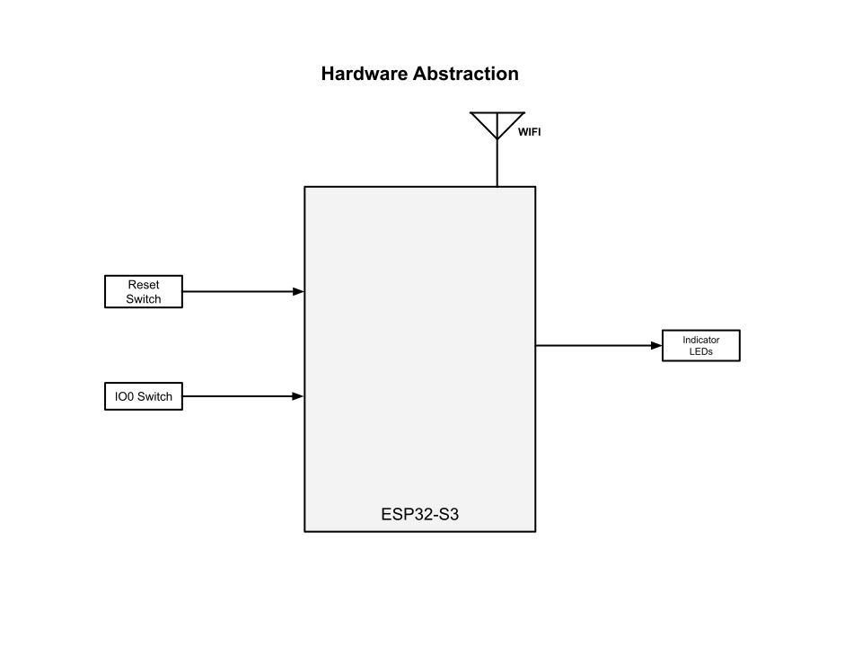

# Project Abstraction
This is a generic project with no particular purpose other than to log into a Wifi host, obtain Unix Epoch time, and provide a little bit of visual feedback through an LED.  We have a single tactile switch to trigger user input.

The abstraction on a project level is very simple.  Additional abstractions can be found for the System, Wifi, NVS, SNTP, and Indication components by exploring the document directories in those source code areas.  
