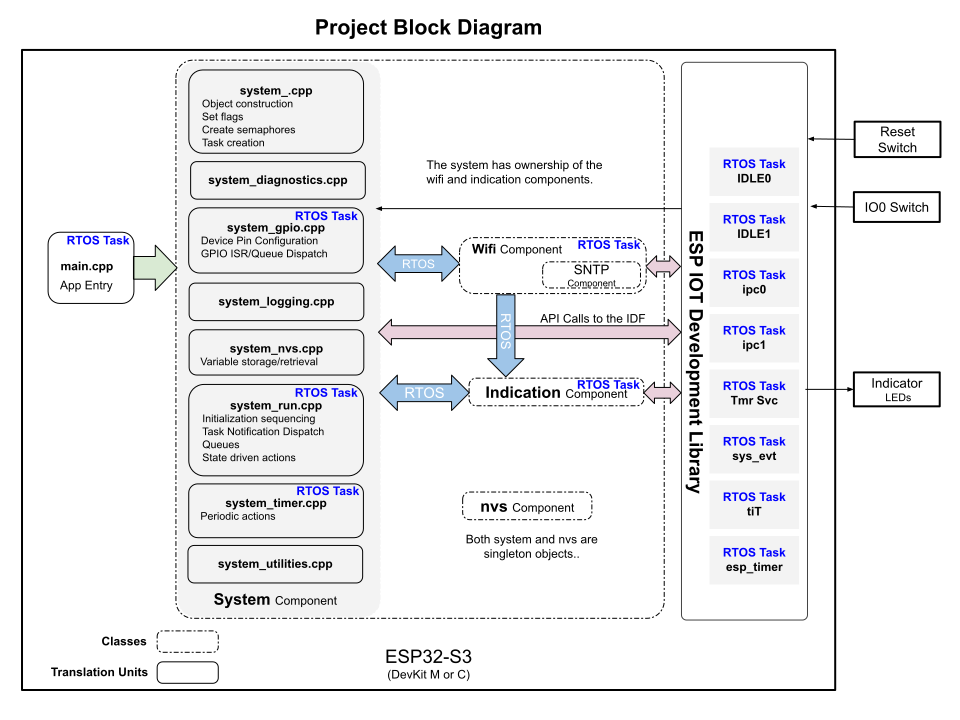

# Project Blocks
Here again is our project block diagram.  We are also see in this diagram some detail on what would be considered the system object.

### Main:
The main is just the app entry point and doesn't do much for the application.  Shortly after starting the system, the main exits and it's task memory is reclaimed.  Main does nothing else at this time.

### System:
The System is a singleton object and remains resident and active for the entire lifetime of the application.  The System will only be destroyed and restarted upon a hardware reboot.

From a practical perspective, the System owns all the other objects and controls their life cycles and activity states.

The System contains 3 core services:
* **GPIO**
This service runs a task that manages GPIO and responds to GPIO interrupts.  Any number of pin interupts can be handled or monitored here.  It is worth mentioning that many peripherals will initialize their own pins and handle their own interrupts without the need for this service.

* **Run**
The Run service is a task based service that would be considered the "super loop" for the entire system.  Run spins up all the objects, handles Task Notification, Commands, and makes decisions on operation based on other input.  Run is also the service that would take the entire system into and out of sleep states (currently not implemented).

* **Timer**
The system supplies a timer service that offers a highly accurate way to trigger action on a period basis.  Action can be taken in seconds, minutes, hours even possibly days and months.  The majority of the work is done on fairly short time lengths.   As ane example, the service helps out the GPIO service with some switch debouncing timing.

### Indication:
The Indication component controls an exteral LED indicator for feedback to the user.  Any object inside the system may supply a Task Notification to the Indication object to trigger a 1 or 2 number flashing code in variety colors.

At start-up, this object outputs the firmware version number in RGB color.  Red for MAJOR, Green for MINOR, Blue for PATCH number of the firmware.

This version of the indication object is programmed to operate a 1 wire output using the RMT (remote control transceiver) driver to control an WS2812 LED.

### Wifi:
The Wifi component handles all the communication to the TCP/IP stack.  It may also optionally make calls to SNTP, and handle Wifi Provisioning (not included in this base project)

## Tasks
Behind the scenes, the IDF starts a number of tasks which are important to be aware of.   A complete task list can be generated a run time with the printRunTimeStats() function which is located in system_diagnostics.   (printRunTimeStats() is a special function and you'll need to be aware of its limited use.)

### IDLE Tasks:
IDLE tasks are freeRTOS processes which run when a CPU cores are in the idle state.   Each IDLE task (IDLE0 and IDLE1) is pinned to their respective cores.  Priority for IDLE tasks are always 0 (lowest priority).

### ipc Tasks:
ipc stands for Inter Processor Communication.

### sys_evt Task:
The default system event loop creates this task to handle events on that loop.  When a call-back for an event is invoked, this task runs that call-back.

### tiT Task:
This is the main task for the TCP-IP stack (LwIP).

### Tmr Svc Task:
This is the primary freeRTOS Daemon Task.

### esp_timer:
This task is created in response to any timer tasks that you create.  This Task is the one that makes the timer call-back.

### Other Tasks:
Other than the list above, most other tasks are created in code.  These will be servicing objects in system created components (which are not seen yet in this sample application).

### ESP-IDF:
This is the primary library that Espressif creates to provide you all the services that you need, but where is Arduino?   Now that you're an expert, or becomming an expert, you won't need an intermedate library like Arduino, or MongooseOS.  Intermediate libraries can add trouble with unreachable bugs that you just can't fix.  If you can accept the Esp32 hardware product and its companion IDF library, then the whole world is your oyster, and it is up to you to master key concepts and produce the best product possible with Esp32 hardware.  If you can master the IDF, then no one on the planet can make a smaller, better, faster, Esp32 application than you can.