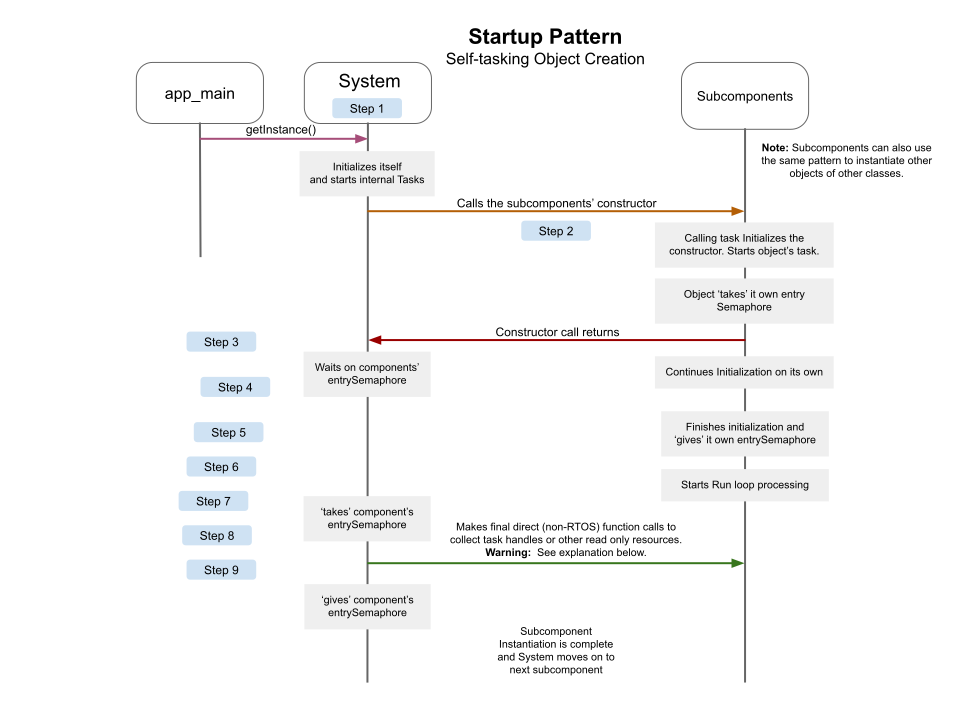
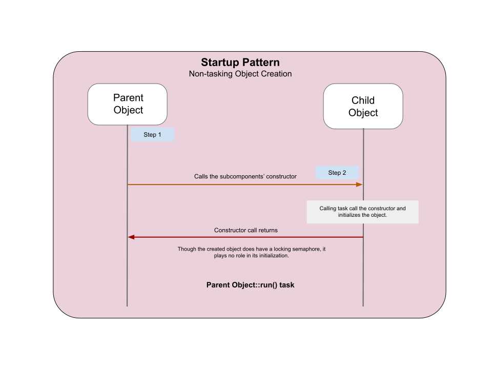

# Project Sequences
At a project level, this sequence explains the general startup process between the System and all other objects which run their own tasks.  

The app_main() starts the System.  Each in turn, the System instantiates the remaining supporting components.

**The key thing to observe here is how the System starts another object.**

app_main -> System
The entry point calls sys->getInstance and this task (main task) run through the entire System contructor.

**Throughout the project, this pattern is applied to all independant objects.**  An independant object is one with its own running task.  A task-less object is depicted in the next section of this document.

* Step 1: app_main calls getInstance() of the System.  That constructer calls the member functions:
  * setFlags() - Static enabling of logging statements for any area of concern during development.
  * setLogLevels() - Manually sets log levels for tasks down the call stack for development.
  * createSemaphores() - Creates any locking semaphores owned by this object.
  * restoreVariablesFromNVS() - Brings back all our persistant data.
  * Starts a run task (if the object is designed to have a task).

* Step 2: System calls on a class constructor.  The system's run task (thread) runs a set of member functions much like those of the system's constructor.  This pattern stays consistant for the sake of good programming practice.

* Step 3: The created object (typically of a subcomponent) 'takes' its own entry semaphore.  This locks that semaphore.  The purpose during initialization is that the System waits for that semaphore to become available so that it knows the initializaiton process can continue back at its run task.

* Step 4: The created object run an initialization loop of its own to fully initialize.

* Step 5: Created object finishes its initialization and releases the locking semaphore.

* Step 6: Created object begins to operating inside its normal Run loop.

    **Warning is here**  
* Step 7: The System, now knowing that the create object is fully initialized, calls back to several "task unsafe" member functions to gather key RTOS handles.  These calls, though unsafe are typically not dangerous either as the variables are written once at the created object and read once by the System object.  The chance for unsafe read/write collisions at start up are impossible at present because the created object never reads or writes those particular variable RTOS handles again after the first time in the contructor.

* Step 8: The System releases the object locking semaphore.  It is important to understand that most object locking semaphores are never used again after intialization of the object.  The notiable exception to this are objects without RTOS access features (Task Notification or Queues).  Without RTOS entry, the only want to abritrate entrance to an object is with a locking semaphore (or mutex, or some other construct).

* Step 1: Calling object is already initialized and running its own task.

* Step 2: Calling object calls the created object's constructer.  These member functions are called:
  * setFlags() - Static enabling of logging statements for any area of concern during development.
  * setLogLevels() - Manually sets log levels for tasks down the call stack for development.
  * createSemaphores() - Creates any locking semaphores owned by this object.
  * restoreVariablesFromNVS() - Brings back all our persistant data for the created object.

