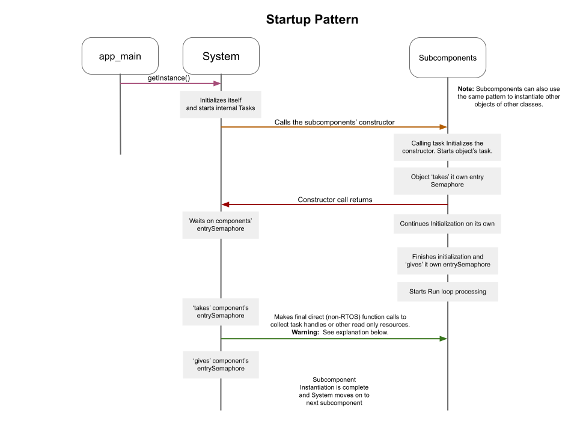

# Project Sequences
At a project level, this sequence explains the general startup process between the System and all other objects which run their own tasks.  Here, the app_main() starts the System.  In turn the System instantiates the remaining supporting components.

**The key thing to observe here is how the System starts another object.**

app_main -> System
The entry point calls sys->getInstance and this task (main task) run through the entire System contructor.

* Step 1: app_main calls getInstance() of the System.  That constructer calls the member functions:
  * setFlags() - Static enabling of logging statements for any area of concern during development.
  * setLogLevels() - Manually sets log levels for tasks down the call stack for development.
  * createSemaphores() - Creates any locking semaphores owned by this object.
  * restoreVariablesFromNVS() - Brings back all our persistant data.
  * Starts a run task (if the object is designed to have a task).

Throughout the project, this pattern follows all objects during construction.  

**Warning:** The final calls to the component object are dangerous with respect to cross Task (thread) safety. The calls are in most cases just retreiving important RTOS varibles that are needed to setup cross Task sharing of data.   For example, we can't send a Task Notification or send to a Queue without handles to those items.

To mitigate risks, the component initializes those data varibles early before it "gives" its entrySemaphore.   And the calling System object "takes" the component's entrySemaphore before reading those variable handles.   All this typically happens during startup when all system activity is very limited and very predicatble and the result so far have been very trouble free.

This is enough detail for a Project Level description.