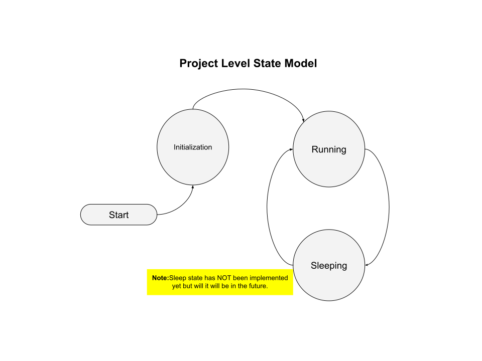

# Project State Transition Diagrams
At the top level, we might consider the system going to sleep a state change, but low power modes have not be added to this sample project yet.  

Our intended level state transition model can be summed up as follows:
