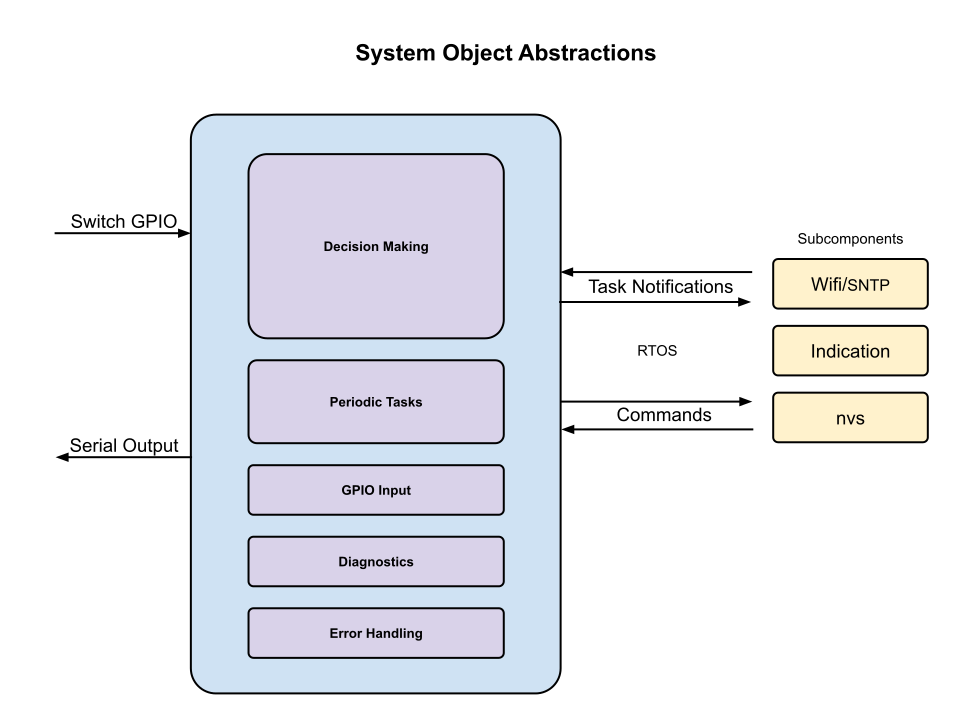

# System Abstractions
Taking note of our abstraction levels helps us keep the design intent clear between files and functions.

The system class in itself is a top level class in our project.  The intent of the System is to be the foundation of the project.  Master control is held here.

___  
# Top-Level

* **Run Handling:** 
The system makes decisions in the Run handler of the System object.  We can also invoke actions.  The system is also reponsible for low power sleep activities or complete hardware restarting.

* **Timer Handling:** 
Timers are limited in hardware.  We offer up a timing service to the System which can be used to invoke actions on the system level. 

* **GPIO Handling:** 
We organized GPIO activities at a system level as much as possible so that timer resources are conserved and the system can be put to sleep more efficietly.

* **Diagnostics:** 
The system is responsible for any top level diagnostic operations.  This may include memory analysis or task profiling.  Typically, lower level objects will not start
diagnostics on their own because this could intefere with system control.

* **Error Handling:**
The final decision on error handling happends at the System level. 
___  
# Mid-Level

* **Logging:** 
Logging is a mid-level activity because all classes control their own logging.  This code may be viewed as redundant between class and perhaps should be moved to it's own class.

* **NVS:** 
This is a mid-level activity because the system_nvs routines call on the nvs class object to handle the lowest level access in the project.  System_nvs retreives/stores only system level values of interest.  During storage, our areas of concern are to evaluate default values and to catch and exclude values outside of defined bounds.
___  
# Low-Level

The system will make calls directly back to the ESP-IDF.  There are no other intermediate libraries between the System and the IDF.
___  