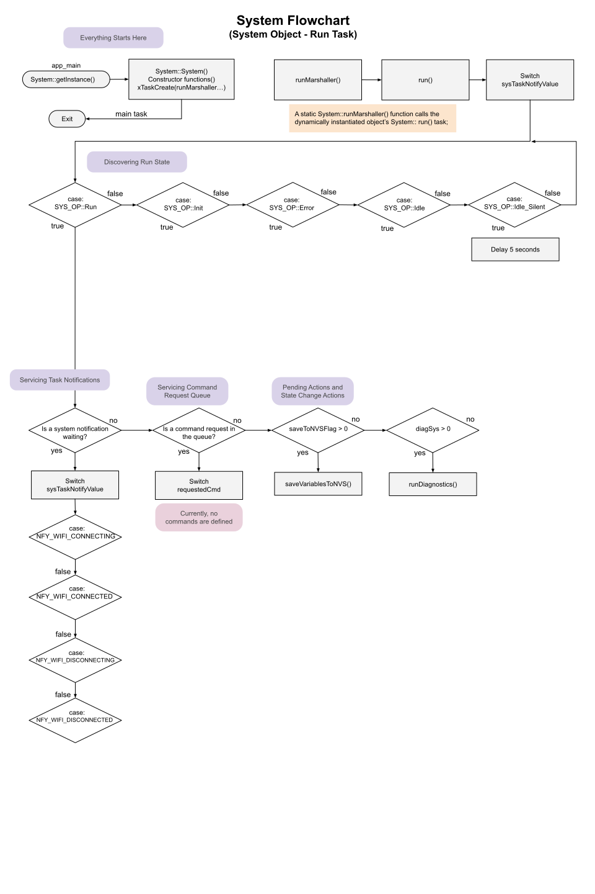

# System Flowcharts
We are listing all the flowcharts that represent active tasks first.  

## system_run.cpp flowchart
This is the most important area of processing for the entire project.

## system_timer.cpp flowchart
Our periodic functions are generated in the timer task area.

## system_gpio.cpp flowchart
This area handles all our local GPIO servicing.  All structure here is directed by Espressif from their documentation.