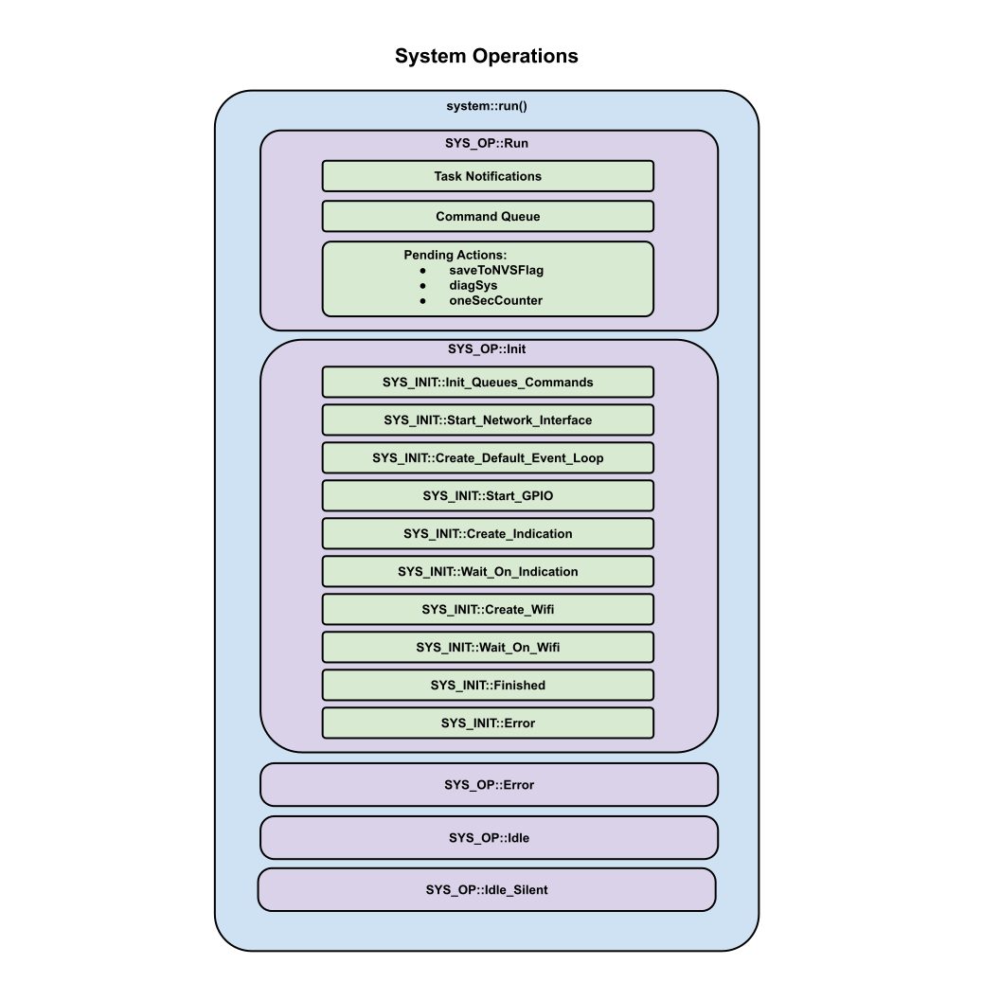

# System Operations

We define a list of system operations in system_enum.hpp.  There currently only 5.  These operations lead to all other sub-operations project wide.

* Run Operation
* Init Operation
* Error Operation
* Idle Operation

### Run Operation
In all objects, a Run operation (contained inside a Run task) is centeral to it's normal operation.  Most of a task's time is spent here.  The Run operation watches for any RTOS communications, it looks for pending actions, and sometimes state changes.  The object's Run task will always return to the centeralized Run operation when waiting is require before the next required action.  In most cases, we have set the loop cycles to 4Hz, but this could be adjusted if processing in any particular object requires a lower latency response time.

### Init Operation
Most objects have an initialization startup requirement.  Initialization typically occurs right after the creation of the object and during this time the object is usually locked so the outside world can't interfere with it's initialization.   At this time, we don't look for RTOS communication.

### Error Operation
All Error operations everywhere try to handle any recoverable errors at the level for which they exist.  Usually, errors are forwarded on until they reach their highest level and then an error message is routed to a message handler.

### Idle Operation
Idle operation is more of a developmental tool where you can intercept unexepected results.
