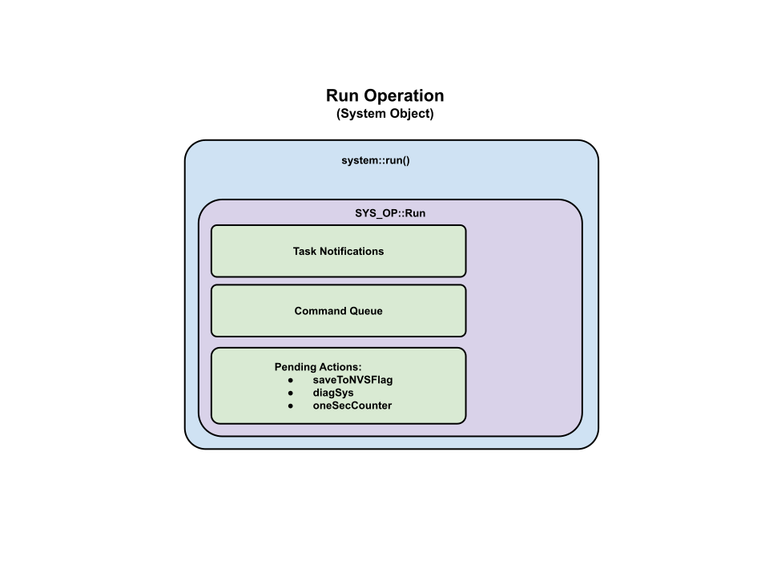

# System Operations

We define a list of system operations in system_enum.hpp.  There currently only 5.  These operations lead to all other sub-operations project wide.

### Run Operation

### Init Operation

### Error Operation

### Idle Operation

### Idle_Silent Operation