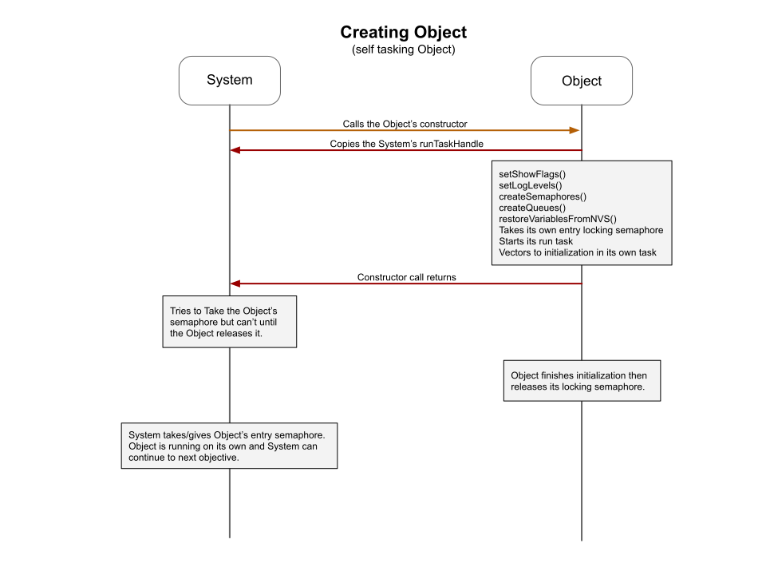
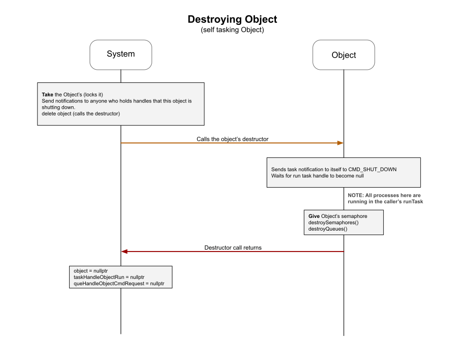

# System Sequences
The creatation of the system object and the generalized process of creating subcomponents (with Tasks and without Tasks) is detailed at the project level [here](../../docs/project_sequences.md)

Sequencing is typically represented as a series of actions between two parties over time.  In the case of software, these parties are either objects or translations units.

In our specific case, we use sequences to represent sequential action between two or more objects.

## Creating Tasking Object  
This is a very simplified view of a common pattern where the System is creating another object which has its own run task.  
 
___  
## Destroying Tasking Object  
This is a very simplified view of a common pattern where the System is destroying another object which has its own run task.  
 
___  
