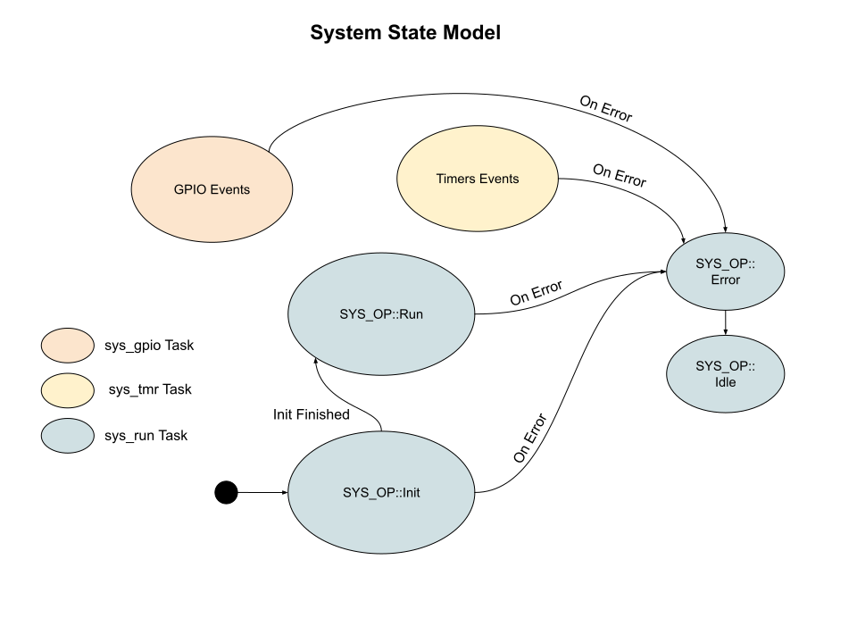
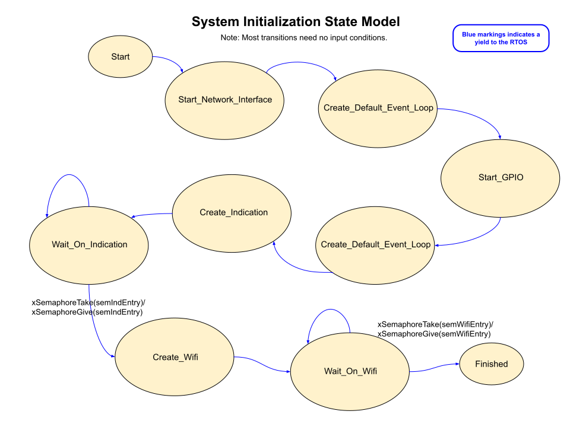

# System State Transition Diagrams
Most of the state transition models for the System are related to System Operations.  These operations take place in the run() function located in system_run.cpp.  You can reference descriptions of System Operations [here](./system_operations.md)

**This is our top level model for the System (main) component:**

The system state as a whole is not always so clearly defined due to the fact that 3 threads run at the system level.  You might consider that these are 3 related sub-systems which cooperate when required through RTOS messaging techniques.  After initialization, the system is always in the Run state and handling either Task Notifications, Commands from a Queue, or responding to variable changes.

The GPIO task is always available to handle gpio generated interrupts.  All communication between the GPIO task and the Run task must use thread safe RTOS techniques.

The Timer task is currently always running and creating timer events which invoke RTOS mechanisms to send task notifications or change local System variables.
___  
## System Initializaton Operation
This is the state transition model for SYS_OP::Init above.  Very few of the state changes here need input.  Likewise, very few state changes produce output.  Most of these states are small so as to release the CPU often.

___  
## Other States?
We do not define states inside SYS_OP::Run, GPIO Events, or Timer Events.  Those operations is can be viewed by a flowchart on this [page](./system_flowcharts.md).